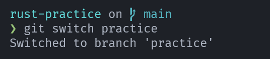
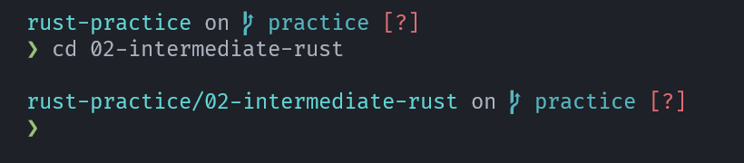
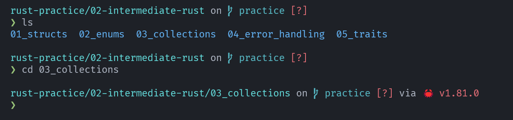
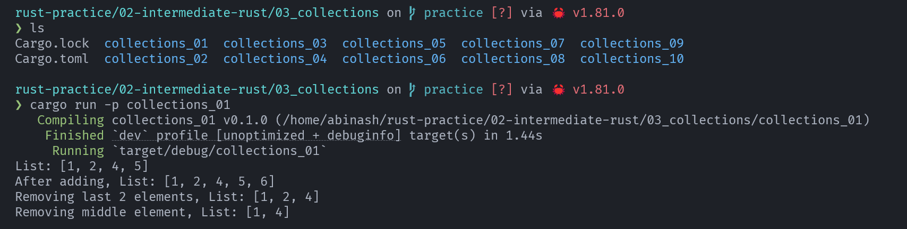

# rust-practice

If you are already reading this, it means you know more about `rust-practice`, so I am not wasting your time by again explaining what `rust-practice` is.

If you are on your IDE, I recommend you install a markdown preview extension for reading easily.

## Why do you need to read this?

Primarily this guide is built for beginners like me.

This file quickly explains things like "How to get started?"  "What to know before starting this?" "What if I encountered any problem?" "Where are the solutions?"

You can skip this document if;

1. You have already installed Rust on your machine and configured it.
2. You know the basics of Rust, which means "How to run a Rust program?".
3. You have basic knowledge of `cargo workspaces` things like "What is `cargo workspaces`?", "What are members?" and "How to run a program that is a member of a `workspace`?".

If you have already known all of these concepts you can skip this document, if not I highly suggest you read this document carefully before starting any exercises.

I promise you after reading this you will never face any problem running, navigating or finding solutions for any of these exercises.

Also, if you have knowledge of those above concepts, I recommend you to please read the [folder structure](#folder-structure) part to know the basic file structure and format it follows.

## Folder Structure

This guide is divided into 3 parts.

1. Levels
2. Topics
3. Exercises

### 1. Levels

Levels indicate the concept difficulty.

e.g. Basics, Intermediate, Advanced and Projects

If you are a beginner, you should start with the "Basics", but you can start from anywhere you want.

Every level is a folder containing all the topics that belong to this level.

Naming convention:- `01-basic-rust`, `02-intermediate-rust`, `03-advanced-rust`, `04-projects`

### 2. Topics

Topics you can think of like individual Rust concepts.

e.g. `variables`, `functions`, `enums`, `async` etc

Every level consists of 5-7 topics sorted according to their difficulty level.

e.g. `Basics` consists of topics like `variables`, `functions` etc whereas `Advanced` consists of topics like `async`, `unsafe Rust` etc.

Each topic is a `cargo workspace` (Do not worry, if you do not know what `cargo workspace` is, we have covered it in the later section.) and contains 10 members representing the 10 exercises it contains.

Naming convention:- `02_varibales`, `03_data_types`, `04_control_flow`

### 3. Exercises

Every topic consists of 10 different exercises.

I included 10 exercises in every topic so that after solving all these exercises you can have a strong grasp on that topic.

Each exercise is a member of the `workspace` it belongs to.

e.g. `basic rust` is a level, it has topic/workspaces in it like `02_variables`and it has exercises like `varibales_01`, `varibales_02` and so on.

Naming convention:- `varibales_01`, `functions_06`, `async_03` etc

### Other Folders and Files

1. **Image Folder**
    - It contains images that are used in the `README.md` file.
2. **Quick Links**
    - Quick links is a file, that contains direct links to all exercises(i.e. links to `src/main.rs` files).

```markdown
├── 00-must-read-before-practice 
├── 01-basic-rust                           // Level
│   └── 01_hello_world                      // Topic
│       ├── Cargo.lock
│       ├── Cargo.toml
│       └── hello_world_01                  // Exercise
│           ├── Cargo.toml
│           └── src
│               └── main.rs                 // Solution
├── 02-intermediate-rust
├── 03-advanced-rust
├── 04-projects
├──images                                   // Images Folder
│   └── rust-practice-map.png               // Mind Map 
├── LICENSE
├── QUICK_LINKS.md                          // Direct Links
├── README.md
└── SECURITY.md
```

I hope you got the idea of how this guide is structured.

For context; this guide has 4 levels, and 24 topics and each topic has 10 exercise that means a total of 240 exercises to solve.

## How to get started?

If you have read till now, I am assuming that you are totally new to Rust and its Community, so the rest of the document is designed like so.

Before starting this exercise you have to complete the steps mentioned below;

1. Install Rust
2. Configure Your IDE
3. How to navigate through exercises?
4. How to run your code?
5. Prerequisites

### 1. Install Rust

To install your Rust on your machine, Go to the official Rust website([link](https://www.rust-lang.org/tools/install)) and follow the instructions to install Rust.

Also, if you prefer video tutorial you can watch this -> [Introduction To Rust Programming](https://www.youtube.com/watch?v=T_KrYLW4jw8&pp=ygUQaG93IGluc3RhbGwgcnVzdA%3D%3D).

### 2. Configure Your IDE

I am using VSCode + WSL to develop any Rust program.

If you are also using VSCode then these are the list of extensions, I am currently using.

1. rust-analyzer ([link](https://marketplace.visualstudio.com/items?itemName=rust-lang.rust-analyzer)) - For linting, and code suggestions.
2. crates-io ([link](https://marketplace.visualstudio.com/items?itemName=BarbossHack.crates-io)) - For crates version management.
3. Even Better TOML ([link](https://marketplace.visualstudio.com/items?itemName=tamasfe.even-better-toml)) - To format `.toml` files.
4. CodeLLDB ([link](https://marketplace.visualstudio.com/items?itemName=vadimcn.vscode-lldb)) - To debug Rust code.
5. Error Lens ([link](https://marketplace.visualstudio.com/items?itemName=usernamehw.errorlens)) - Highlights your error messages.

Also, here are some YouTube videos you can watch to set up your IDE.

1. [IDE Setup For Rust Development](https://youtu.be/x_iZEK6Rww4?si=l4AmKMdpThjkgDbA)
2. [The perfect Neovim setup for Rust.](https://youtu.be/mh_EJhH49Ms?si=FDDGfZoxYHDe-I9j)

Also, you can do your own research to configure your IDE for your needs.

### How to navigate through exercises?

For navigation, you can go through folders but I recommend you to go to [Quick Links](../QUICK_LINKS.md) file and click on the exercise you want to solve, then it will take you to the `src/main.rs` file of the exercise.

Each `src/main.rs` file contains the following sections.

1. At the top, the problem statement.
2. Then the link to the solution of that exercise. (Do not watch the solution on the day you are solving the exercise, go read some documentation, watch some tutorials on that topic, search on Google, then come tomorrow and try again.)
3. Links to resources related to that topic or exercises.
4. Then the `main` function which only contains the basic `hello_world` program, remove the `hello_world` program and write your own solution in your own way.

### How to run your code?

Before learning how to run your rus program, we have to understand "What are cargo workspaces and their members?".

#### Cargo Workspace

Cargo workspaces are used to manage multiple related Rust projects under a single folder.

For example, `variables` has 10 different exercises but represent a single concept so, we can put them in a single folder.

Yes, we can make every exercise a single Rust project, but it would become more cluttered and huge.

Now. let's understand the file structure of a typical `workspace`.

```markdown
my_workspace/
├── Cargo.toml  # Root Cargo.toml for the workspace
└── member1/
    ├── Cargo.toml  # Cargo.toml for member1
    └── src/
        └── main.rs  # Main Rust file for the member1 binary
```

To run the program written in `member1`;

```bash
cargo run -p member1 # run it at workspace level.
```

Let's see the actual workflow of you solving an exercise and running it in your terminal.

1. Fork the repo and clone to your local machine.
2. Change the directory and switch the git branch to `practice`.

```bash
cd rust-practice
git switch practice
```



3. Change your directory to the level of your choice. For example, I am changing to `02-intermediate-rust`.

```bash
cd 02-intermediate-rust
```



Please ignore the "❓" sign, it is because of the git.

4. Do a quick `ls` and change your directory to the topic of your choice.

```bash
ls
cd 03_collections
```



**Now, you are at the workspace level. Please remember it.**

At this level you will run the run command to get output from your exercises.

Let's do a quick `ls` and run an exercise.

```bash
ls
cargo run -p collections_01
```



So, every time you want to run your exercise, run the `cargo run -p exercise_name` at your workspace level.

There are more details about it, but for now this is sufficient for you to get started.

### Prerequisite

I highly recomend you to follow this guide along with the Rust official book/docs. ([link](https://doc.rust-lang.org/book/), I love to read this on the `ayu` theme, you can try it.)

First, read a single chapter then come here and do the exercises, by this approach, you will gain both thoritical and practical hands-on-exprence.

## Final Thoughts

I designed it for myself to learn and practice Rust because I have some dream CLI tools to build, then I came to know that lots of beginners like me are facing problems while learning Rust.

So, I created this guide.

If you are getting value from this, Please Give this a ⭐ on GitHub and share your exprence on the discussion tab.

Have a great day.

Happe Rust Journey!🦀
