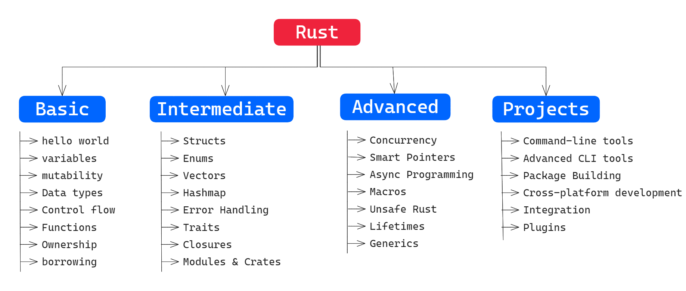

# Rust Practice

This repository tracks my progress of learning Rust, focusing on building production-grade CLI tools.

The exercises are structured to cover all essential Rust concepts, from basics like variables and control flow to advanced topics like asynchronous programming and unsafe Rust and contain tiny projects that teach how to build efficient and scalable production-ready CLI apps.

> This repo contains 240+ exercises.

- **First time here? Say hello👋🏻 to everyone [here](https://github.com/fnabinash/rust-practice/discussions/5).**
- **Check out the [updates & Announcements](https://github.com/fnabinash/rust-practice/discussions/17) tab for latest insights.**
- **If you have any questions, feel free to ask in [Q&A](https://github.com/fnabinash/rust-practice/discussions/4) discussion tab.**
- **To practice yourself, please navigate to the [practice](https://github.com/fnabinash/rust-practice/tree/practice) branch.**

## Table of Contents

1. [Folder Structure](#folder-structure)
2. [Exercises](#exercises)
    <details>
      <summary>Basic Rust</summary>

      <ol>
      <li><a href="#hello-world-05">hello world</a></li>
      <li><a href="#variables-and-mutability-15">variables and mutability</a></li>
      <li><a href="#data-types-and-casting-3">data types</a></li>
      <li><a href="#control-flow-5">control flow</a></li>
      <li><a href="#functions-7">functions</a></li>
      <li><a href="#ownership-and-borrowing-10">Ownership and borrowing</a></li>
      </ol>
    </details>

    <details>
      <summary>Intermediate Rust</summary>

      <ol>
      <li><a href="#structs-12">structs</a></li>
      <li><a href="#enums-and-pattern-matching-14">enums</a></li>
      <li><a href="#collections-vectors-hashmaps-18">collections</a></li>
      <li><a href="#error-handling-21">error handling</a></li>
      <li><a href="#traits-24">traits</a></li>
      <li><a href="#iterators-and-closures-28">iterators and closures</a></li>
      <li><a href="#modules-and-crates-30">modules and crates</a></li>
      </ol>
    </details>

    <details>
      <summary>Advanced Rust</summary>

      <ol>
      <li><a href="#concurrency-35">concurrency</a></li>
      <li><a href="#asynchronous-programming-41">asynchronous programming</a></li>
      <li><a href="#smart-pointers-box-rc-refcell-47">smart pointers</a></li>
      <li><a href="#macros-54">macros</a></li>
      <li><a href="#unsafe-rust-63">unsafe rust</a></li>
      <li><a href="#lifetimes-and-generics-70">lifetimes and generics</a></li>
      </ol>
    </details>

    <details>
      <summary>Projects</summary>

      <ol>
      <li><a href="#command-line-tool-73">command line tool</a></li>
      <li><a href="#advanced-cli-projects-78">advanced CLI projects</a></li>
      <li><a href="#package-building-85">package building</a></li>
      <li><a href="#cross-platform-development-91">cross-platform development</a></li>
      <li><a href="#integration-plugins-and-systems-100">integrations, plugins and systems</a></li>
      </ol>
    </details>
3. [Contributing](#contributing-)
4. [License](#license-)
5. [Acknowledgement](#acknowledgment-)

## Folder Structure
This repo is divided into 3 types of folders.
1. **Levels**
    - Level indicates the difficulty of exercises.
    - e.g. Basic, Intermediate, Advanced, Projects
2. **Topics**
    - Each level contains multiple topics.
    - Each topic is a cargo workspace.
    - e.g. `variables`, `functions`, `enums`, `traits` ...
3. **Exercises**
    - Each topic contains 10 exercises.
    - Each exercise is a member of that workspace.
    - e.g. `variables_01`, `variables_02`, `variables_03` ...

### Other Folders and Files
1. **Image Folder**
    - It contains images that are used in the `README.md` file.
2. **Quick Links**
    - Quick links is a file, that contains links to solutions for all exercises(i.e. links to `src/main.rs`).

```  
├── 01-basic-rust                           // Level
│   └── 01_hello_world                      // Topic
│       ├── Cargo.lock
│       ├── Cargo.toml
│       └── hello_world_01                  // Exercise
│           ├── Cargo.toml
│           └── src
│               └── main.rs                 // Solution
├── 02-intermediate-rust
├── 03-advanced-rust
├── 04-projects
├──images                                   // Images Folder
│   └── rust-practice-map.png               // Mind Map
├── CODE_OF_CONDUCT.md
├── CONTRIBUTING.md
├── LICENSE
├── QUICK_LINKS.md                          // Direct Links
├── README.md
└── SECURITY.md
```

> You can quickly navigate to solutions using **[Quick Links](https://github.com/fnabinash/rust-practice/blob/main/QUICK_LINKS.md)**.

## Exercises

### 1. **Basics Rust (10%)**

#### Hello, World! (0.5%)

- [X] Print "Hello, World!" to the console.
- [X] Modify the program to take user input and print "Hello, [name]!".
- [X] Create a program that prints a greeting based on the time of day.
- [X] Print a multi-line string using raw strings.
- [X] Format a string with multiple variables and print it.
- [X] Print a list of numbers from 1 to 10
- [X] Print the length of a given string.
- [X] Print the result of basic arithmetic operations.
- [X] Print a countdown from 10 to 1
- [X] Create a program that prints a quote using escape characters.

#### Variables and Mutability (1.5%)

- [X] Swap two variables without using a third variable.
- [X] Declare a constant and print its value.
- [X] Create a mutable variable and change its value inside a loop.
- [X] Shadow a variable and print both values.
- [X] Create a program that calculates the area of a rectangle.
- [X] Convert a string to an integer and print the result.
- [X] Declare a variable with a tuple and access its elements.
- [X] Create a program that doubles the value of a number using a mutable variable.
- [X] Implement a program that changes a variable's value based on user input.
- [X] Create a program that increments a counter variable each time a button is pressed.

#### Data Types and Casting (3%)

- [X] Convert a floating-point number to an integer.
- [X] Parse a string as a number and perform arithmetic on it.
- [X] Convert a number from one type to another and print the result.
- [X] Create a program that determines the type of a variable.
- [X] Implement a program that calculates the square root of a number.
- [X] Create a program that converts Celsius to Fahrenheit.
- [X] Convert a number to a string and concatenate it with another string.
- [X] Write a program that casts an integer to a character.
- [X] Convert a number from binary to decimal.
- [X] Create a program that calculates the area of a circle using a floating-point number.

#### Control Flow (5%)

- [X] Implement a program that checks if a number is even or odd.
- [X] Write a simple program that uses `if-else` to compare two numbers.
- [X] Create a calculator using a match statement.
- [X] Implement a program that checks whether a character is a vowel or consonant.
- [X] Write a program that checks if a number is positive, negative, or zero.
- [X] Implement a program that finds the largest of three numbers.
- [X] Create a program that simulates a basic traffic light system.
- [X] Write a program that checks if a year is a leap year.
- [X] Create a simple menu-driven program using a loop-and-match statement.
- [X] Write a program that calculates the factorial of a number using a loop.

#### Functions (7%)

- [X] Create a function that returns the square of a number.
- [X] Implement a function that takes two numbers and returns their sum.
- [X] Write a function that checks if a number is prime.
- [X] Implement a function that returns the nth Fibonacci number.
- [X] Write a function that reverses a string.
- [X] Create a function that checks if a string is a palindrome.
- [X] Implement a function that returns the maximum of two numbers.
- [X] Write a function that calculates the greatest common divisor (GCD) of two numbers.
- [X] Implement a function that calculates the sum of an array of numbers.
- [X] Create a function that generates a random number within a specified range.

#### Ownership and Borrowing (10%)

- [X] Create a function that takes ownership of a string and prints it.
- [X] Implement a function that borrows a string and returns its length.
- [X] Write a function that takes two borrowed strings and concatenates them.
- [X] Create a function that returns ownership of a string to the caller.
- [X] Implement a function that modifies a borrowed string using mutable references.
- [X] Write a program that demonstrates the use of multiple references.
- [X] Create a function that borrows an array and returns its sum.
- [X] Implement a program that shows how ownership changes when a variable is reassigned.
- [X] Write a function that takes ownership of a vector and returns its length.
- [X] Create a program that demonstrates the use of references in function parameters and return types.

### 2. **Intermediate Rust (20%)**

#### Structs (12%)

- [X] Create a `struct` to represent a book with fields for title, author, and pages.
- [X] Implement a method for the book `struct` to display its details.
- [X] Write a program that creates a `struct` to represent a point in 2D space and calculate the distance between two points.
- [X] Create a `struct` to represent a rectangle and calculate its area.
- [X] Implement a `struct` to represent a student with fields for name, age, and grades, and calculate the average grade.
- [X] Write a program that creates a `struct` to represent a complex number and implements methods for addition and subtraction.
- [X] Create a `struct` to represent a car with fields for make, model, and year, and implement methods to start and stop the car.
- [X] Implement a `struct` to represent a bank account with fields for account number, balance, and owner, and create methods to deposit and withdraw money.
- [X] Write a program that creates a `struct` to represent a person with fields for name, age, and address, and implement methods to update the address.
- [X] Create a `struct` to represent a circle with a field for radius, and implement methods to calculate the circumference and area.

#### Enums and Pattern Matching (14%)

- [X] Create an `enum` to represent traffic light states and use pattern matching to display messages.
- [X] Implement a program that uses an `enum` to represent different shapes (Circle, Square, Rectangle) and calculate their area.
- [X] Write a program that uses an `enum` to represent the result of a calculation (Success, Error) and uses pattern matching to handle both cases.
- [X] Create an `enum` to represent different types of users (Admin, Guest, Registered) and use pattern matching to display messages based on user type.
- [X] Implement a program that uses an `enum` to represent different payment methods (CreditCard, PayPal, Cash) and calculate the total cost based on the payment method.
- [X] Write a program that uses an `enum` to represent different file types (Text, Binary, Image) and use pattern matching to process files based on their type.
- [X] Create an `enum` to represent different weather conditions (Sunny, Rainy, Cloudy) and use pattern matching to display appropriate messages.
- [X] Implement a program that uses an `enum` to represent the status of an order (Pending, Shipped, Delivered) and use pattern matching to update the status.
- [X] Write a program that uses an `enum` to represent different error types (NotFound, PermissionDenied, Unknown) and use pattern matching to handle errors.
- [X] Create an `enum` to represent different operations (Add, Subtract, Multiply, Divide) and use pattern matching to implement a basic calculator.

#### Collections (Vectors, HashMaps) (18%)

- [X] Create a program that adds and removes elements from a vector.
- [X] Implement a program that finds the largest number in a vector.
- [X] Write a program that sorts a vector of integers in ascending and descending order.
- [X] Create a program that removes duplicate elements from a vector.
- [X] Implement a program that uses a `HashMap` to count the occurrences of words in a text.
- [X] Write a program that stores student grades in a `HashMap` and calculates the average grade.
- [X] Create a program that stores user preferences in a `HashMap` and allows updating and retrieving preferences.
- [X] Implement a program that uses a `HashMap` to group words by their first letter.
- [X] Write a program that uses a `HashMap` to store and retrieve configuration settings.
- [X] Create a program that uses a `HashMap` to implement a basic phone book with names and phone numbers.

#### Error Handling (21%)

- [X] Write a program that handles file reading errors and displays an appropriate message if the file is not found.
- [X] Implement a function that returns a `Result` type and handles both success and error cases.
- [X] Create a program that parses a string as an integer and handles invalid input with error messages.
- [X] Write a function that attempts to open a file and returns a custom error type if the file cannot be opened.
- [X] Implement a program that reads user input and handles errors if the input is not a valid number.
- [X] Create a program that uses `Option` to handle missing values and displays a default value if a value is `None`.
- [X] Write a program that attempts to divide two numbers and handles division by zero errors.
- [X] Implement a function that performs a calculation and returns a `Result` type with a custom error message if the calculation fails.
- [X] Create a program that reads a configuration file and handles errors if the file is missing or corrupted.
- [X] Write a function that attempts to connect to a server and returns a custom error type if the connection fails.

#### Traits (24%)

- [X] Create a trait called `Printable` with a method `print` and implement it for different types (e.g., `struct`, `enum`).
- [X] Write a program that creates a trait called `Calculable` with methods for addition, subtraction, multiplication, and division, and implement it for a `struct` representing a calculator.
- [X] Implement a trait called `Drawable` with a method `draw` and implement it for different shapes (`Circle`, `Square`, `Rectangle`).
- [X] Write a program that creates a trait called `Serializable` with methods for serializing and deserializing data, and implement it for a `struct` representing a user.
- [X] Implement a trait called `Comparable` with a method `compare` and implement it for different types (`i32`, `f64`, `String`).
- [X] Write a program that creates a trait called `Cloneable` with a method `clone` and implement it for a `struct` representing a document.
- [X] Implement a trait called `Readable` with a method `read` and implement it for different file types.
- [X]  Create a trait called Filterable with a method filter that filters elements from a collection of structs representing products (Product { name, price, in_stock }).
- [X] Create a trait called StateTransition with a method transition that takes an charachter and based on his score change his level in  GameLevel (with levels like Beginner, Intermediate, and Expert).
- [X] Create a trait called Loggable with a method log that takes an object and logs its state.

#### Iterators and Closures (28%)

- [ ] Create a program that uses an iterator to sum all elements in a vector.
- [ ] Implement a program that filters out even numbers from a vector using an iterator.
- [ ] Write a program that maps a vector of integers to their squares using an iterator.
- [ ] Create a program that uses an iterator to find the first element in a vector that satisfies a condition.
- [ ] Implement a program that creates a custom iterator for a `struct` representing a range of numbers.
- [ ] Write a program that chains multiple iterators to process a vector of numbers.
- [ ] Create a program that uses a closure to sort a vector of integers in descending order.
- [ ] Implement a program that uses a closure to filter a vector of strings based on their length.
- [ ] Write a program that uses a closure to find the maximum value in a vector of integers.
- [ ] Create a program that uses a closure to generate a sequence of numbers and returns the result as a vector.

#### Modules and Crates (30%)

- [ ] Create a module to organize functions for mathematical operations and use it in a main program.
- [ ] Implement a program that uses a module to organize functions for file handling and use it in a main program.
- [ ] Write a program that creates a module to organize functions for string processing and use it in a main program.
- [ ] Create a module to organize functions for error handling and use it in a main program.
- [ ] Implement a program that uses a module to organize functions for working with collections (`Vector`, `HashMap`) and use it in a main program.
- [ ] Write a program that creates a module to organize functions for networking (e.g., making HTTP requests) and use it in a main program.
- [ ] Create a crate for common utilities (e.g., logging, configuration) and use it in a project.
- [ ] Implement a program that creates a module to organize functions for working with dates and times and use it in a main program.
- [ ] Write a program that creates a crate to provide a library of functions for data serialization (e.g., JSON, XML) and use it in a project.
- [ ] Create a program that uses a third-party crate (e.g., `serde`, `regex`) and organizes the code into modules.

### 3. **Advanced Rust(40%)**

#### Concurrency (35%)

- [ ] Write a program that uses threads to perform multiple calculations in parallel.
- [ ] Implement a program that spawns multiple threads to process a large array and combines the results.
- [ ] Create a program that uses channels to send messages between threads.
- [ ] Implement a program that uses a thread pool to manage and execute multiple tasks concurrently.
- [ ] Write a program that uses `Arc` (atomic reference counting) to share data between threads safely.
- [ ] Create a program that uses `Mutex` to protect shared data from race conditions.
- [ ] Implement a program that uses `RwLock` to allow multiple readers or one writer at a time.
- [ ] Write a program that uses threads to download multiple files concurrently.
- [ ] Create a program that implements a simple producer-consumer pattern using threads and channels.
- [ ] Implement a program that uses threads to simulate a basic chat server where multiple clients can send and receive messages concurrently.

#### Asynchronous Programming (41%)

- [ ] Write an asynchronous program that fetches data from a web API using `async/await`.
- [ ] Implement a program that performs multiple HTTP requests concurrently using `async/await`.
- [ ] Create an asynchronous program that reads and writes to a file without blocking the main thread.
- [ ] Write a program that uses asynchronous functions to perform a long-running task in the background.
- [ ] Implement a program that uses `tokio` or `async-std` to create an asynchronous TCP server.
- [ ] Create an asynchronous program that simulates a delay using `tokio::time::sleep` or similar.
- [ ] Write a program that performs multiple database queries concurrently using asynchronous functions.
- [ ] Implement an asynchronous program that streams data from a source and processes it in real-time.
- [ ] Create an asynchronous program that handles multiple client connections to a server concurrently.
- [ ] Write a program that uses asynchronous functions to manage a pool of resources (e.g., database connections).

#### Smart Pointers (Box, Rc, RefCell) (47%)

- [ ] Write a program that uses `Box` to create a linked list.
- [ ] Implement a program that uses `Rc` to create a tree data structure with shared ownership of nodes.
- [ ] Create a program that uses `RefCell` to modify data inside a `struct` with shared ownership.
- [ ] Write a program that uses `Box` to create a recursive data structure (e.g., a binary tree).
- [ ] Implement a program that uses `Rc` to share a configuration object between multiple threads.
- [ ] Create a program that uses `RefCell` to implement interior mutability in a `struct`.
- [ ] Write a program that uses `Rc` and `RefCell` together to create a graph data structure.
- [ ] Implement a program that uses `Box` to store a trait object and call methods on it dynamically.
- [ ] Create a program that uses `Rc` to manage a list of subscribers in a publish-subscribe pattern.
- [ ] Write a program that uses `RefCell` to dynamically update a data structure while maintaining shared ownership.

#### Macros (54%)

- [ ] Write a simple macro that prints "Hello, Macro!" to the console.
- [ ] Implement a macro that calculates the square of a number.
- [ ] Create a macro that generates getter and setter methods for a `struct`.
- [ ] Write a macro that repeats a block of code a specified number of times.
- [ ] Implement a macro that generates a match statement for an `enum` with multiple variants.
- [ ] Create a macro that generates a function to create a new instance of a `struct`.
- [ ] Write a macro that implements a trait for a `struct`.
- [ ] Implement a macro that creates a vector with a specified number of elements.
- [ ] Create a macro that performs compile-time checks on a `struct` field.
- [ ] Write a macro that generates code for a custom `Debug` implementation for a `struct`.

#### Unsafe Rust (63%)

- [ ] Write a program that uses raw pointers to access and modify memory.
- [ ] Implement a program that uses unsafe code to call a C function from Rust.
- [ ] Create a program that uses unsafe code to implement a custom memory allocator.
- [ ] Write a program that uses unsafe code to bypass Rust's borrowing rules and modify data.
- [ ] Implement a program that uses unsafe code to create a custom smart pointer.
- [ ] Create a program that uses unsafe code to implement a linked list with raw pointers.
- [ ] Write a program that uses unsafe code to optimize a performance-critical section of code.
- [ ] Implement a program that uses unsafe code to implement a custom trait for a foreign type.
- [ ] Create a program that uses unsafe code to directly access hardware registers.
- [ ] Write a program that uses unsafe code to create a low-level system library.

#### Lifetimes and Generics (70%)

- [ ] Write a program that uses lifetimes to ensure references are valid.
- [ ] Implement a function that uses generics to work with multiple data types.
- [ ] Create a program that uses lifetimes and generics together to create a flexible data structure.
- [ ] Write a function that returns a reference with a lifetime annotation.
- [ ] Implement a generic function that works with any type that implements a specific trait.
- [ ] Create a program that uses lifetimes to manage references in a data structure.
- [ ] Write a generic function that returns the larger of two values.
- [ ] Implement a program that uses lifetimes to manage the scope of a borrowed value.
- [ ] Create a program that uses generics to implement a custom collection type.
- [ ] Write a program that uses lifetimes and generics to implement a flexible and reusable function.

### 4. **Projects (30%)**

#### Command-Line Tool (73%)

- [ ] Create a simple CLI tool that greets the user with their name.
- [ ] Implement a CLI tool that fetches weather information from an API.
- [ ] Write a CLI tool that performs basic file operations (e.g., create, read, write, delete).
- [ ] Create a CLI tool that interacts with a database to store and retrieve data.
- [ ] Implement a CLI tool that performs basic arithmetic operations with command-line arguments.
- [ ] Write a CLI tool that parses JSON data from a file and displays it in a readable format.
- [ ] Create a CLI tool that downloads files from the internet and saves them locally.
- [ ] Implement a CLI tool that converts data between different formats (e.g., CSV to JSON).
- [ ] Write a CLI tool that manages a to-do list with add, remove, and list operations.
- [ ] Create a CLI tool that interacts with a web API to send and receive data.

#### Advanced CLI Projects (78%)

- [ ] File Searcher: Create a CLI tool that recursively searches for files by name in a directory.
- [ ] Process Manager: Build a CLI tool to list and manage system processes (e.g., kill processes).
- [ ] Database CRUD: Create a CLI tool that performs basic CRUD operations on a SQLite database.
- [ ] Config File Parser: Build a CLI tool that reads and edits configuration files (e.g., JSON, TOML).
- [ ] API Client: Create a CLI tool that interacts with a REST API to fetch and display data.
- [ ] Log Analyzer: Build a CLI tool to parse and analyze log files, providing statistics and error reports.
- [ ] Markdown to HTML Converter: Create a CLI tool that converts Markdown files into HTML.
- [ ] Task Runner: Build a CLI tool that schedules and runs predefined tasks (like a simple cron job).
- [ ] Backup Manager: Create a CLI tool to automate the backup of files to a specified location.
- [ ] Git Helper: Build a CLI tool that wraps common Git commands to simplify version control tasks.

#### Package Building (85%)

- [ ] Basic Packager: Create a CLI tool that packages a Rust project into a binary for distribution.
- [ ] Cross-Compiler: Build a CLI tool that cross-compiles a Rust project for different platforms.
- [ ] Installer Generator: Create a CLI tool that generates an installer for a Rust application.
- [ ] Tarball Creator: Build a CLI tool that packages a project into a tarball with optional compression.
- [ ] Binary Size Analyzer: Create a CLI tool that analyzes and reports the size of a compiled binary.
- [ ] Release Packager: Build a CLI tool that automates the creation of release packages with versioning.
- [ ] Installer Validator: Create a CLI tool that verifies the integrity and correctness of an installer.
- [ ] Package Signer: Build a CLI tool that signs packages with a cryptographic signature.
- [ ] Deb/RPM Package Creator: Create a CLI tool that builds a Debian or RPM package from a Rust project.
- [ ] Multi-Platform Installer: Build a CLI tool that generates installers for multiple platforms (e.g., Windows, macOS, Linux).

#### Cross-Platform Development (91%)

- [ ] Multi-OS CLI Tool: Create a CLI tool that runs on Windows, macOS, and Linux with platform-specific features.
- [ ] Cross-Platform File Watcher: Build a CLI tool that watches for file changes on different operating systems.
- [ ] Universal Package Manager: Create a CLI tool that works with multiple package managers (e.g., apt, brew, chocolatey).
- [ ] Portable CLI Tool: Build a CLI tool that requires no installation and runs from a USB drive.
- [ ] Cross-Platform Logger: Create a CLI tool that logs system events across different operating systems.
- [ ] Environment Configuration Tool: Build a CLI tool that configures environment variables for different OSs.
- [ ] Cross-Platform Process Monitor: Create a CLI tool that monitors system processes on multiple operating systems.
- [ ] Universal Installer: Build a CLI tool that installs software packages across different platforms.
- [ ] Multi-OS Backup Tool: Create a CLI tool that performs backups on different operating systems.
- [ ] Cross-Platform Clipboard Manager: Build a CLI tool that manages the clipboard across different operating systems.

#### Integration, Plugins, and Systems (100%)

- [ ] Plugin System: Create a CLI tool that supports plugins, allowing users to extend its functionality.
- [ ] API Gateway: Build a CLI tool that acts as a gateway for integrating with multiple APIs.
- [ ] Task Scheduler: Create a CLI tool that schedules and runs tasks at specified intervals, integrating with system cron jobs.
- [ ] Messaging Queue Client: Build a CLI tool that interacts with a message queue system (e.g., RabbitMQ, Kafka).
- [ ] Service Integrator: Create a CLI tool that integrates with cloud services (e.g., AWS, GCP) and performs tasks.
- [ ] Database Migrator: Build a CLI tool that manages database migrations and integrates with different database systems.
- [ ] CI/CD Pipeline Integrator: Create a CLI tool that integrates with CI/CD systems like Jenkins or GitHub Actions.
- [ ] System Monitor Integrator: Build a CLI tool that integrates with system monitoring tools (e.g., Prometheus, Grafana).
- [ ] Custom Shell: Create a CLI tool that acts as a custom shell with support for plugins and extensions.
- [ ] Configuration Manager: Build a CLI tool that manages configuration files and integrates with other system tools.

## Contributing 🤝

Contributions are welcome! If you have any suggestions, improvements, or new exercises, feel free to open an issue or submit a pull request. Let's make this repository a valuable resource for everyone learning Rust.

## License 📜

This project is licensed under the MIT License. See the [LICENSE](LICENSE) file for details.

## Acknowledgment 🙏

A big thank you to the Rust community and all the contributors who have helped make this repository better. Your support and feedback are greatly appreciated.

## Contact 📬

For any questions or feedback, you can reach out to me on [GitHub](https://github.com/fnabinash) or [Dev.to](https://dev.to/fnabinash).
